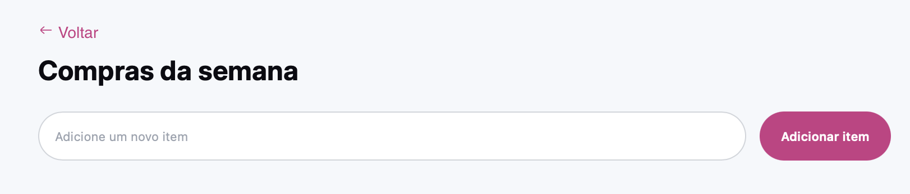

<h1 align="center"> Quicklist </h1>

<p align="center">
Aplicação simples para gerenciar uma lista de compras, focada em HTML, CSS e JavaScript puros (KISS).<br/>
Interface baseada em styleguide próprio (Inter, cores e ícones).
</p>

<p align="center">
  <a href="#-tecnologias">Tecnologias</a>&nbsp;&nbsp;&nbsp;|&nbsp;&nbsp;&nbsp;
  <a href="#-projeto">Projeto</a>&nbsp;&nbsp;&nbsp;|&nbsp;&nbsp;&nbsp;
  <a href="#-layout">Layout</a>&nbsp;&nbsp;&nbsp;|&nbsp;&nbsp;&nbsp;
  <a href="#-como-rodar">Como rodar</a>&nbsp;&nbsp;&nbsp;|&nbsp;&nbsp;&nbsp;
  <a href="#memo-licença">Licença</a>
</p>

<p align="center">
  
</p>

<br>

<p align="center">
  
</p>

## 🚀 Tecnologias

Este projeto foi desenvolvido com:

- **HTML** (semântica simples)
- **CSS** (tokens de cores, tipografia Inter, componentes: botão, text field, checkbox)
- **JavaScript** (DOM API pura)
- **Git e Github**
- **Figma** (styleguide/layout)

## 💻 Projeto

O **Quicklist** é uma aplicação leve para criar uma **lista de compras**.

### Funcionalidades
- Adicionar um item à lista
- Remover um item da lista
- Checkbox customizado com **check (✓)** usando icon font do styleguide
- Campo de texto com estados **default/hover/focus** (borda + ring)
- Layout **responsivo** (mobile-first, empilhando input/botão)
- Alerta simples ao remover item

> Foco no princípio **Keep it Simple (KISS)**: zero dependências, apenas HTML/CSS/JS.

- [Acesse o projeto online](https://moteixeira.github.io/dev-compras)
- [Repositório](https://github.com/moteixeira/dev-compras) 

## 🔖 Layout

Você pode visualizar o **styleguide/layout** aqui:
- [Figma – Styleguide / Layout](https://www.figma.com/design/toAutXx9Qdjun5LpyCQk1a/Lista-de-compras--Community-?m=auto&t=BSRktnsUNMR3RpAb-7)
- É necessário ter conta no [Figma](https://figma.com) para acessar.

## 🧱 Estrutura (resumo)
/
```
├─ assets
  ├─ preview.png
├─ index.html
├─ style.css
├─ script.js
```


